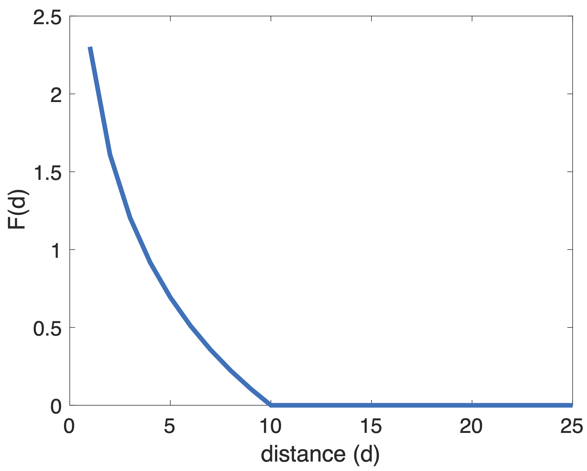
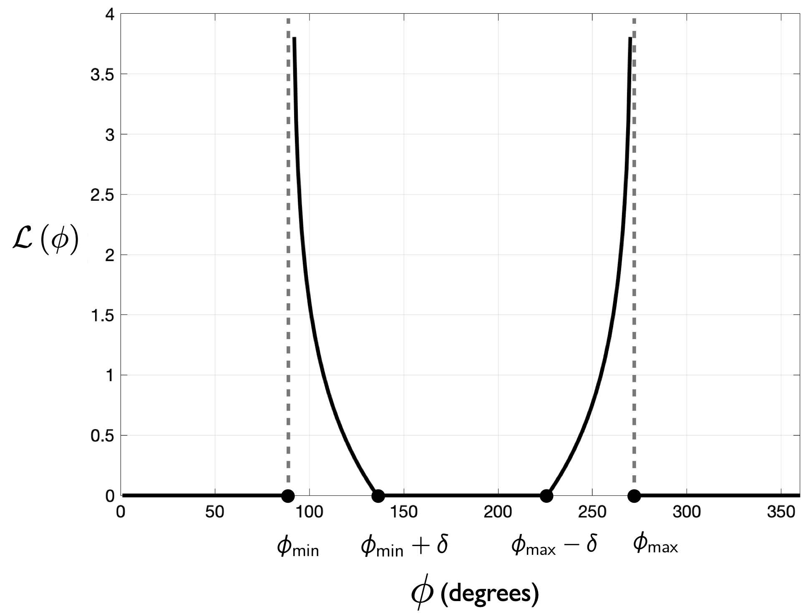
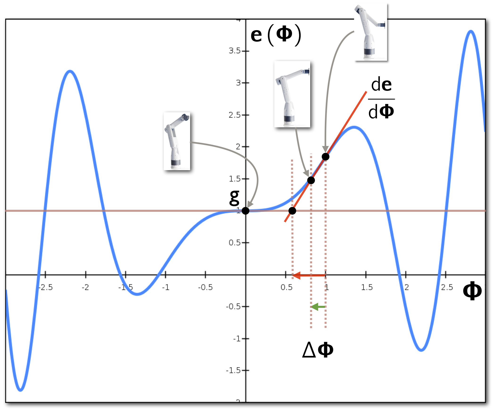

# Inverse Kinematics with Obstacle Avoidance by Cost Minimization

## Overview

These notes describe a method for creating an animation of a robot arm by (iteratively) minimizing a cost function. This is a path-planning solution that minimizes a multi-objective cost function.  The arm will move from an initial position to a set of multiple goal positions. As the arm moves, it should  avoid collisions with the various obstacles in the scene. The original method is from Breen's paper [1]. Figure 1 shows a pose of the robot arm as it moves from one target location to another. 

**Figure 1:** Goal-oriented animation: The robot arm moves from one target location to another while avoiding obstacles. 

These notes are heavily based on the following coursework and tutorial materials: 

- Steve Rotenberg's lectures slides from the CSE 169 Computer Animation course (https://cseweb.ucsd.edu/classes/sp16/cse169-a/sessions.html).
- Samuel Buss' notes on Inverse Kinematics (https://groups.csail.mit.edu/drl/journal_club/papers/033005/buss-2004.pdf).
- The online tutorial by Alan Zucconi (https://www.alanzucconi.com/2017/04/10/robotic-arms/). 

## The cost function and its components

The animation is achieved by using the gradient-descent algorithm to solve the following minimization problem: 
$$
\begin{align}
	\hat{\bf \Phi} = \arg_{{{\bf \Phi}}}\min  C\left({\bf \Phi}\right),
	\label{simple_motion_min}
\end{align}
$$
where the cost function $C$ is defined by:
$$
\begin{align}
	C\left({\bf \Phi}\right) = \underbrace{\|{\bf e}\left({\bf \Phi}\right) - {\bf g}\|}_{\text{goal attraction}} + \underbrace{\sum_{i=1}^{n} \mathcal{F}_R\left(\|{\bf e}\left({\bf \Phi}\right) - {\bf o}_i\|\right)}_{\text{obstacle-avoidance penalty}} + \underbrace{\sum_{j=1}^{3} \mathcal{L}\left(\phi_j\right)}_{\text{Joint-range limit}}.
	\label{simple_motion}
\end{align}
$$
Here, ${\bf g} = \left(x_g, y_g, z_g\right)^\mathsf{T}$ is the *goal location*, ${\bf o}_i$ is the location of obstacle $i$. Function ${\bf e}\left({\bf \Phi}\right)$ computes the arm's *forward kinematics* and returns the location of the arm's tip ${\bf e} = \left( e_x, e_y, e_z \right)^\mathsf{T}$, i.e., the *end-effector,* given the arm's joint angles, ${\bf \Phi} = \left( \phi_1, \phi_2,  \phi_3, \phi_4\right)^\mathsf{T}$.   Function $\mathcal{F}_R$ is a collision-avoidance penalty field. It penalizes poses that take the end effector too close to an obstacle, i.e., beyond a pre-defined distance $R$. The third component of Equation $\ref{simple_motion}$  limits the range of each joint angle. Function $\mathcal{L}$ is another penalty function. Its value increases as the joint angle $\phi_j$ approaches its maximum or minimum limit. Outside these limits, $\mathcal{L}$ vanishes. 

Next, we describe the components of Equation $\ref{simple_motion}$ in more detail. 

### The attraction term

The goal attraction term guides the animation towards the goal location. Since its equation is the Euclidean norm (or Euclidean distance), the minimal solution path when disregarding obstacles and joint range limits is a straight line from the end-effector's current location to the goal location.   
$$
\begin{align}
	C_1\left({\bf \Phi}\right) = \|{\bf e}\left({\bf \Phi}\right) - {\bf g}\|
\end{align}
$$

### The field potential function for obstacle avoidance

The field potential is a *penalty term* that increases its value as the end effector approaches an obstacle. It is defined as follows: 
$$
\begin{align}
        \mathcal{F}_R\left(d\right) = 
	\begin{cases}
		\ln\left(R/d\right), & 0 < d \leq R,\\
		0,                         &d > R.
	\end{cases}
	\label{field_function1}
\end{align}	
$$
An example of the field potential in $\ref{field_function1}$ is shown in Figure 2.

**Figure 2:** Penalty field function for $R=10$.  **Left**: One-dimensional plot of the penalty function. Penalty value increases for distances close to the obstacle. **Right**: 2-D representation of the field function for $d = \sqrt{x^2 + y^2}$, i.e., distance from any point $(x,y)$ to the origin. When the  distance from obstacle is larger than $R$, the field potential vanishes. 

###The range-of-motion limit function  

The limit function constrains the range of motion of the joints (i.e., angles), and is given by: 
$$
\begin{align}
        \mathcal{L}\left(\phi\right) = 
	\begin{cases}
		\ln\left(\delta/\left(\phi-\phi_\text{min}\right)\right), & \phi_\text{min} < \phi \leq \phi_\text{min} + \delta\\
		0,                         & \phi_\text{min} + \delta < \phi < \phi_\text{max} - \delta\\
		\ln\left(\delta/\left(\phi_\text{max} - \phi\right)\right), & \phi_\text{max} - \delta \leq \phi < \phi_\text{max},\\
	\end{cases}
	\label{limit_function}
\end{align}
$$
where $\phi$ is the joint angle, $\phi_\text{min}$ and $\phi_\text{max}$ are the limits of that joint, and $\delta$ is the angular distance from each of the limits after which the limit function vanishes.  Figure 3 shows an example of the limit function for $\delta = 45\degree$, $\phi_{\text{min}} = 90\degree$, and $\phi_{\text{max}} = 270\degree$.

**Figure 3:** Limit function. One-dimensional plot of the limit function $\mathcal{L}$. For a given joint angle $\phi \in \left(\phi_{\text{min}},\phi_{\text{max}}\right)$, the penalty value increases as the joint angle approaches the limits. 

## Inverse kinematics

The forward-kinematics function can be used to move the robot arm given a set of (known) joint angles as input. In computer graphics, forward kinematics also helps us to draw the robot arm. However, forward kinematics is of little help when we want to move the arm's end effector to a specific location in space and we do not know the joint angles that perform the desired motion. In this case, we need to compute the *inverse kinematics*. To compute the joint-angle configuration for a given goal position of the end effector, we use inverse kinematics, which is the inverse of the forward-kinematics function, i.e.: 
$$
\begin{align}
        {\bf \Phi} = f^{-1}\left({\bf e}\right).
	\label{ik}
\end{align}	
$$
However, this function does not usually have a closed-form solution. In addition, non-linearity will cause it to have multiple solutions. Instead of trying to solve the inverse kinematics directly, we can make progress by using an iterative numerical-minimization method such as the gradient descent. 

### Solving the inverse kinematics numerically

One numerical method used for computing inverse kinematics works is based on the gradient-descent approach, and attempts to find the best incremental changes in joint-angle configuration that take the end effector closer a goal position (and orientation). In the gradient-descent method, the best direction for incremental changes in the function variables is the inverse of the gradient. Because the forward-kinematics function is a vector function of vector variables, the "gradient" vector is replaced by the Jacobian matrix. 

The path obtained by the gradient-descent solution is the path of the animation. Here, we want to determine how incremental changes of joint-angle configuration relate to incremental changes of end-effector location, i.e.,  we want to find out how to relate changes in any component of ${\bf \Phi}$ with changes in any component of ${\bf e}$. With this relationship at hand, we can derive an iterative algorithm analogous to the gradient-descent to calculate the arm's pose needed to reach a given location.

#### Relating variations of pose to variations of end-effector location

To relate small changes between values of a function and small variations of its variables, we can use derivatives. Indeed, the derivative of forward-kinematics function, $d{\bf e}/d{\bf \Phi}$, contains all the information we need to know about how to relate changes in any component of $\bf \Phi$ to changes in any component of ${\bf e}$.  Because the forward-kinematics function ${\bf e}$ is a vector-valued function of the vector-valued variable $\bf \Phi$, its  derivative is given by the Jacobian. The Jacobian for a robot arm with 4 joint angles is then:  
$$
\begin{align}
          \frac{d\,\bf e}{d\,\bf \Phi}  &= J\left({\bf e},{\bf \Phi}\right) = 
          \begin{bmatrix}
          	 \dfrac{\partial{\bf e}}{\partial\phi_1}  & \dfrac{\partial{\bf e}}{\partial\phi_2}  & \dfrac{\partial{\bf e}}{\partial\phi_3}  & \dfrac{\partial{\bf e}}{\partial\phi_4}
          \end{bmatrix} = 
          \begin{bmatrix}
          	 \dfrac{\partial e_x}{\partial\phi_1}  & \dfrac{\partial e_x}{\partial\phi_2}   & \dfrac{\partial e_x}{\partial\phi_3}  & \dfrac{\partial e_x}{\partial\phi_4}\\[1em]
          	 \dfrac{\partial e_y}{\partial\phi_1}  & \dfrac{\partial e_y}{\partial\phi_2}   & \dfrac{\partial e_y}{\partial\phi_3}  & \dfrac{\partial e_y}{\partial\phi_4}\\[1em]	 
          	 \dfrac{\partial e_z}{\partial\phi_1}  & \dfrac{\partial e_z}{\partial\phi_2}   & \dfrac{\partial e_z}{\partial\phi_3}  & \dfrac{\partial e_z}{\partial\phi_4}	 
	 \end{bmatrix}.          
	\label{jacobian_e}
\end{align}
$$
The first column vector of this Jacobian, ${\partial{\bf e}}/{\partial\phi_1}$, describes how the end-effector position changes for small changes in join angle $\phi_1$. Similarly, the second column vector, ${\partial{\bf e}}/{\partial\phi_2}$, describes how the end-effector position changes for small changes in join angle $\phi_2$. Note that each component of the Jacobian matrix in Equation $\ref{jacobian_e}$ is equivalent to a 1st-order derivative of a scalar function of a single variable, and can be approximated numerically using finite differences. The approximated Jacobian is then: 
$$
\begin{align}
          J\left({\bf e},{\bf \Phi}\right) \approx  
          \begin{bmatrix}
          	 \dfrac{\Delta{\bf e}}{\Delta\phi_1}  & \dfrac{\Delta{\bf e}}{\Delta\phi_2}  & \dfrac{\Delta{\bf e}}{\Delta\phi_3}  & \dfrac{\Delta{\bf e}}{\Delta\phi_4}
          \end{bmatrix} =           
          \begin{bmatrix}
          	  \dfrac{\Delta e_x}{\Delta\phi_1}  & \dfrac{\Delta e_x}{\Delta\phi_2}   & \dfrac{\Delta e_x}{\Delta\phi_3}  & \dfrac{\Delta e_x}{\Delta\phi_4}\\[1em]
          	 \dfrac{\Delta e_y}{\Delta\phi_1}  & \dfrac{\Delta e_y}{\Delta\phi_2}   & \dfrac{\Delta e_y}{\Delta\phi_3}  & \dfrac{\Delta e_y}{\Delta\phi_4}\\[1em]	 
          	 \dfrac{\Delta e_z}{\Delta\phi_1}  & \dfrac{\Delta e_z}{\Delta\phi_2}   & \dfrac{\Delta e_z}{\Delta\phi_3}  & \dfrac{\Delta e_z}{\Delta\phi_4}	 
	 \end{bmatrix}.          
	\label{jacobian_e_approx}
\end{align}
$$
for a small $\Delta \phi_i, i=1,\dots,4$, where the elements of the matrix in ($\ref{jacobian_e_approx}$) are forward finite differences. We can also write the columns of the Jacobian matrix in terms of ${\bf e}\left(\Phi\right)$ as follows:
$$
\begin{align}
        \frac{\Delta {\bf e}}{\Delta \phi_i} = \frac{{\bf e}\left({\bf \Phi}+\Delta \phi_i\right) - {\bf e}\left({\bf \Phi}\right)}{\Delta \phi_i},
	\label{approxExample}
\end{align}	
$$
for small $\Delta \phi_i$, and $i=1,\dots,4$. Note that the displacement of ${\bf \Phi}$ by $\Delta \phi_i$ in the calculation of ${\bf e}\left({\bf \Phi}+\Delta \phi_i\right)$ in Equation $\ref{approxExample}$ is applied only to the corresponding joint angle $\phi_i$ which is a component of ${\bf \Phi}$, and not to all components. For example, the position of the end-effector displaced by $\Delta \phi_1$ is:
$$
\begin{align}
       {\bf e}\left({\bf \Phi}+\Delta \phi_1\right) = {\bf e}\left(
       \begin{bmatrix}
       		\phi_1\\   \phi_2\\ \phi_3\\   \phi_4
       \end{bmatrix}
      +
       \begin{bmatrix}
       		\Delta \phi_1\\   0\\ 0\\   0
       \end{bmatrix}      
      \right).
	\label{incrementPhi}
\end{align}
$$
The other displacements are calculated analogously. 

For a numerical example of computing the Jacobian approximation in ($\ref{jacobian_e_approx}$), assume that the current pose of the arm is ${\bf \Phi} = \left( 0, \pi/4,  \pi/4, \pi/4\right)^\mathsf{T}$, and that the lengths of the parts are ${L} = \left( 6, 6,  1, 1\right)^\mathsf{T}$, with the base-joint center located at ${\bf p}_1 = \left( 0, 0,  0\right)^\mathsf{T}$. Here, the local frames are described by their individual transformation matrices, and the world-to-frame transformations are computed as in the notes on forward kinematics. If we set all $\Delta \phi_i = 0.05\degree = (1/20)\times\dfrac{\pi}{180}$ radians, the first column of the approximated Jacobian matrix will be: 
$$
\begin{align}
        \frac{\Delta {\bf e}}{\Delta \phi_1} &= \dfrac{{\bf e}\left({\bf \Phi}+\Delta \phi_1\right) - {\bf e}\left({\bf \Phi}\right)}{\Delta \phi_1} \notag \\
                                                              &= \dfrac{{\bf e}\left(
               \begin{bmatrix}
               		\phi_1\\   \phi_2\\ \phi_3\\   \phi_4
               \end{bmatrix}
              +
               \begin{bmatrix}
               		\Delta \phi_1\\   0\\ 0\\   0
               \end{bmatrix}      
                                                              \right) - {\bf e}\left(
               \begin{bmatrix}
               		\phi_1\\   \phi_2\\ \phi_3\\   \phi_4
               \end{bmatrix}
                                                              \right)}{\Delta \phi_1}  \notag \\
            &=
            \dfrac{{\bf e}\left(
               \begin{bmatrix}
               		0\\   \pi/4\\ \pi/4\\   \pi/4
               \end{bmatrix}
              +
               \begin{bmatrix}
               		\dfrac{1}{20}\times\dfrac{\pi}{180} \\   0\\ 0\\   0
               \end{bmatrix}      
                                                              \right) - {\bf e}\left(
               \begin{bmatrix}
               		0\\   \pi/4\\ \pi/4\\   \pi/4
               \end{bmatrix}
                                                              \right)}{\dfrac{1}{20}\times\dfrac{\pi}{180}}  \notag \\
            &=
            \dfrac{
               \begin{bmatrix}
               		5.9497\\   0.0052\\ 9.5355
               \end{bmatrix}
               -     
               \begin{bmatrix}
               		5.9497\\   0\\ 9.5355
               \end{bmatrix}
                }{\dfrac{1}{20}\times\dfrac{\pi}{180}} 
                = 
               \begin{bmatrix}
               		-0.0026\\   5.9497\\ 0
               \end{bmatrix}.
	\label{approxExampleNumerical}
\end{align}
$$

After computing all columns, the approximated Jacobian matrix is given by: 
$$
\begin{align}
          J\left({\bf e},{\bf \Phi}\right) \approx       
      \begin{bmatrix*}[r]
         -0.0026  &  3.5329   &-0.7079 &  -0.7074\\
    5.9497    &     0     &    0    &     0\\
         0   &-5.9513  & -1.7068 &  -0.7068
	 \end{bmatrix*}.          
	\label{jacobian_e_approx_numbers}
\end{align}
$$
We now have all the ingredients we need to derive a numerical algorithm similar to the gradient descent to compute inverse kinematics. The algorithm's derivation, which is described next, follows the same of the gradient-descent for scalar functions.  

## The gradient-descent for inverse kinematics

### How pose change as a function of end-effector position?

Let $\Delta {\bf \Phi}$ be the vector representing a small change in joint-angle values, which causes the following change in the end effector ${\bf e}$: 
$$
\begin{align}
          \frac{\Delta{\bf e}}{\Delta {\bf \Phi}} &\approx \frac{d\bf e}{d\bf \Phi} \notag \\
          {\Delta{\bf e}} &\approx \frac{d\bf e}{d\bf \Phi}\cdot \Delta {\bf \Phi} \notag \\
          &\approx 	J\left({\bf e},{\bf \Phi}\right) \cdot \Delta {\bf \Phi}  \notag \\
&\approx 	{\bf J} \cdot \Delta {\bf \Phi}.
          \label{end_effector_change_dPhi}
\end{align}
$$
Equation $\ref{end_effector_change_dPhi}$ describes an incremental forward-kinematics computation. We need to calculate an incremental inverse kinematics. To do that, we need to solve Equation $\ref{end_effector_change_dPhi}$ for $\Delta {\bf \Phi}$ as follows: 
$$
\begin{align}
           \Delta{\bf e} &\approx {\bf J} \cdot \Delta {\bf \Phi}  \notag\\        
            \Delta {\bf \Phi} &\approx  {\bf J}^{-1} \cdot \Delta {\bf e}.
          \label{end_effector_change_de}
\end{align}
$$
Often, the Jacobian matrix is not invertible. In fact, this is the case of the Jacobian matrix of the robot arm in these notes (the matrix is not a square matrix). Thus, instead of using the inverse of the Jacobian, we will calculate its *pseudo-inverse*. By using the Jacobian's pseudo-inverse denoted here by ${\bf J}^{\dagger}$, we can re-write Equation $\ref{end_effector_change_de}$ as:  
$$
\begin{align}
            \Delta {\bf \Phi} &\approx  {\bf J}^{\dagger} \cdot \Delta {\bf e}, 
          \label{end_effector_change_de_pseudo_inverse}
\end{align}
$$
where:
$$
\begin{align}
            {\bf J}^{\dagger} = VD^{+}U^\mathsf{T}
          \label{pseudo_inverse}
\end{align}
$$
is the *Moore-Penrose pseudo inverse* of the Jacobian. Here, matrices $U$, $D$, and $V$ are obtained from the Singular Value Decomposition of $J$, i.e., $J = UDV^\mathsf{T}$. 

Thus, given some desired incremental change in the end-effector position, we use ($\ref{end_effector_change_de_pseudo_inverse}$) to compute an appropriate incremental change in joint-angle configuration. 

### Computing the value of  $\Delta {\bf e}$

Equation $\ref{end_effector_change_de}$ depends on the value of  $\Delta {\bf e}$ that will take the end-effector closer to the goal location. Calculating this value is the next step of our algorithm. Let ${\bf \Phi}$ be the current pose of the robot arm and ${\bf e}$ be the current end-effector position. Also, let ${\bf g}$ be the goal position that we want the end effector to reach. When solving inverse kinematics using an iterative approach (i.e., gradient descent), we want to choose a value for $ \Delta{\bf e}$ that will move ${\bf e}$ closer to ${\bf g}$. A reasonable place to start is by setting: 
$$
\begin{align}
           \Delta{\bf e} = {\bf g}  - {\bf e}
          \label{Delta_e}
\end{align}
$$
As in the derivation of the gradient descent for scalar functions, non-linearity prevents the exact solution that would satisfy Equation $\ref{Delta_e}$. Instead, we will take small steps, i.e.: 
$$
\begin{align}
           \Delta{\bf e} = \lambda\left({\bf g}  - {\bf e}\right),
          \label{Delta_e_beta}
\end{align}
$$
with $\lambda \in \left[0, 1\right]$. The basic Jacobian inverse-kinematics algorithm is listed in Algorithm 1. The diagram in Figure 4 shows an analogy between the Jacobian gradient-descent method in and the gradient-descent method for a scalar function of a scalar variable. 

**Figure 4:** Jacobian Inverse Kinematics. Simplified diagram using a 1-D function to represent the forward kinematics cost function. 

### The inverse-kinematics algorithm

**Algorithm 1**: Inverse Kinematics Gradient Descent. 

### Minimizing the cost-function to create the animation 

By using the procedure described in Algorithm 1, we can create a simple animation of the robot arm. However, this animation would be unconstrained as it would not minimize the cost function in Equation $\ref{simple_motion}$. To  minimize the cost function that controls the animation, we can use a two-step approach. In the first step, we calculate the direction of minimal cost, which is to where we want to move the arm. In the second step, we move the arm in that direction by a fraction along the direction of minimal cost . The two steps require computations of inverse kinematics using Algorithm 1, and is illustrated in Figure 5.

**Figure 5:** Computing the direction of minimal cost. First, use inverse kinematics to compute the joint angles ${\bf \Phi}_x, {\bf \Phi}_y, {\bf \Phi}_z$ that would take the end-effector to nearby locations ${\bf e} + \Delta x$, ${\bf e} + \Delta y$, and ${\bf e} + \Delta z$.  Then, compute  costs $C\left({\bf \Phi}_x\right), C\left({\bf \Phi}_y\right), C\left({\bf \Phi}_z\right)$ at those locations. Next, create vector 
	${\bf d} = \left(C\left({\bf \Phi}_x\right), C\left({\bf \Phi}_y\right), C\left({\bf \Phi}_z\right)\right)^\mathsf{T}$. Its reciprocal (i.e., $-{\bf d}$) is the direction of minimal cost. The next (incremental) location of ${\bf e}$ in the animation is given by ${\bf g}_\text{new} = {\bf e} - {\bf d}$. Finally, move the arm towards location ${\bf g}_\text{new}$ using inverse kinematics.

**Algorithm 2:** Animation with cost-function minimization

## References

[1] David E. Breen. Cost minimization for animated geometric models in computer graphics. The Journal of Visualization and Computer Animation, 8(4):201–220, 1997.
